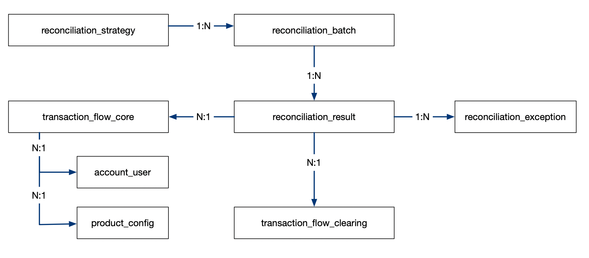
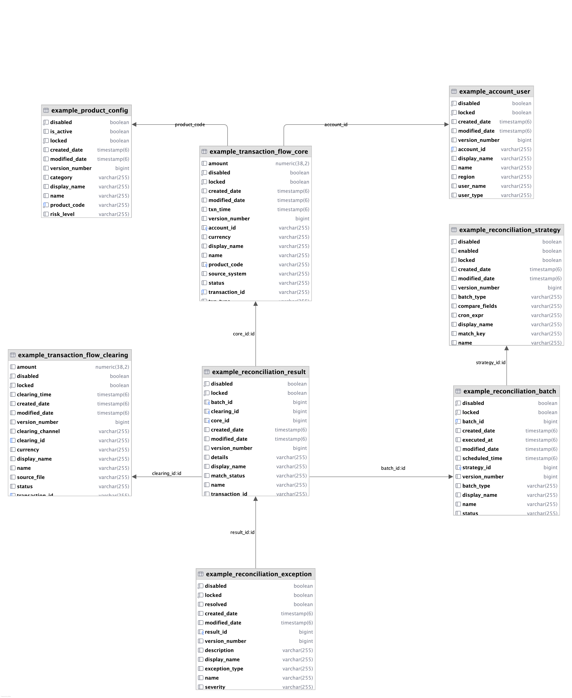
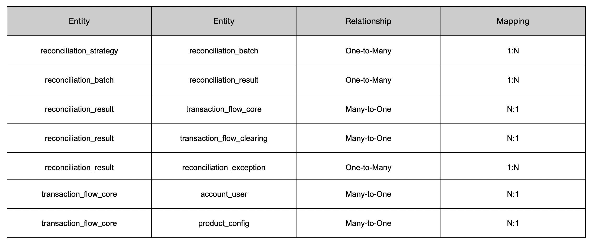

# HQL Fabric Example

## Overview

This example module demonstrates how to integrate **hql-fabric** into a project within a context of **fund
reconciliation** workflows. The goal is to showcase the flexibility and power of **hql-fabric**  when working with both
**native SQL queries** and **Hibernate JPA** in real-world financial scenarios.

## Background

**Fund reconciliation** is a critical operation in financial systems, ensuring that transactional records between the *
*core system** and the **clearing/settlement system** remain consistent.

In this example, we simulate a **simple financial fund reconciliation scenario** using a set of domain-specified
business tables to represent real-world transactional processes.

These test tables are created automatically during application startup via **Flyway migrations** and **JPA entity
mappings**. The corresponding **test data** is also inserted at the Flyway migration phase to ensure that all data is
ready for execution and testing when the example Spring application launches.

- Core transaction flows (`transaction_flow_core`).
- Clearing system flows (`transaction_flow_clearing`).
- Reconciliation results and exceptions.
- Reconciliation strategies and execution batches.

## Objectives

- Demonstrates how to **integrate hql-fabric** into a Spring Boot or Hibernate-based project.
- Explore **multiple query styles** using `hql-fabric`, including:
    - JPA/HQL-based entity queries.
    - Native SQL mappings.
    - Dynamic query assembly using reusable fragments
- Showcase how `hql-fabric` helps with:
    - Reducing boilerplate in complex queries
    - Reusing shared query components across scenarios
    - Ensuring consistent query logic for reconciliation-related data

## Scenarios Covered

This example covers a variety of typical reconciliation queries, such as:

- Matching transactions across core and clearing flows
- Identifying unmatched or duplicate transactions
- Generating reconciliation reports with dynamic filtering
- Querying reconciliation batch results and exception details

## Example Table Descriptions

### E-R Diagrams






### Relationship Summary 




### Core Transaction Flow Table `transaction_flow_core`

Represents transactions recorded by the **core system** (business-initiated layer).

- **SQL**

```sql
CREATE TABLE transaction_flow_core
(
    -- primary key 
    id             BIGINT PRIMARY KEY,

    -- unique transaction reference across all systems
    transaction_id VARCHAR(64)    NOT NULL UNIQUE,

    -- ID of the account that initiated the transaction 
    account_id     VARCHAR(64)    NOT NULL,

    -- code of the financial product involved 
    product_code   VARCHAR(32)    NOT NULL,

    -- transaction type: BUY | SELL | TRANSFER 
    txn_type       VARCHAR(16)    NOT NULL, -- BUY/SELL/TRANSFER

    -- transaction amount 
    amount         DECIMAL(18, 4) NOT NULL,

    -- currency (e.g., USD, CNY, EUR)
    currency       CHAR(3)        NOT NULL,

    -- transaction status: INITIATED | SUCCESS | FAILED 
    status         VARCHAR(32)    NOT NULL,-- INITIATED/SUCCESS/FAILED

    -- timestamp of when the transaction occured 
    txn_time       TIMESTAMP      NOT NULL,

    -- original system name 
    source_system  VARCHAR(32),

    -- record creation timestamp 
    created_at     TIMESTAMP DEFAULT now()
);
```

- **Relationships**
    - N:1 with `account_user` (N-transactions : 1-account)
    - N:1 with `product_config` (N-transactions : 1-product)
    - 1:N with `reconciliation_result`(1-transaction : N-reconciliation_result)

### Clearing Flow Table `transaction_flow_clearing`

Represents transactions processed by the **clearing system**, where actual fund transfers happen.

- **SQL**

```sql
CREATE TABLE transaction_flow_clearing
(
    -- primary key 
    id               BIGINT PRIMARY KEY,

    -- unique clearing reference 
    clearing_id      VARCHAR(64) NOT NULL UNIQUE,

    -- corresponding transaction_id from core system 
    transaction_id   VARCHAR(64) NOT NULL UNIQUE,

    -- channel used (e.g., SWIFT, UnionPay) 
    clearing_channel VARCHAR(32),

    -- cleared amount 
    amount           DECIMAL(18, 4),

    -- currency EUR | USD | CNY 
    currency         CHAR(3),

    -- clearing status 
    status           VARCHAR(32),

    -- time when clearing was processed 
    clearing_time    TIMESTAMP,

    -- original file or respor source 
    source_file      VARCHAR(128),

    -- record creation timestamp 
    created_at       TIMESTAMP DEFAULT now()
); 
```

- **Relationships**
  - 1:N with reconciliation_result

### Reconciliation Strategy Table `reconciliation_strategy`

Defines the **reconciliation rules** and scheduling.

```sql
CREATE TABLE reconciliation_strategy
(
  -- primary key 
    id             BIGINT PRIMARY KEY,

  -- strategy name 
    name           VARCHAR(64),

  -- schedule type: REALTIME | HOURLY | DAILY 
    batch_type     VARCHAR(16), -- REALTIME / HOURLY / DAILY

  -- field used to join core and clearing tables (via transaction_id) 
    match_key      VARCHAR(64), -- transaction_id 

  -- comma-separated list of fields to compare (e.g., amount, status)
    compare_fields TEXT,        -- amount, status

  -- whether the strategy is currently active 
    enabled        BOOLEAN   DEFAULT TRUE,

  -- cron expression for scheduled execution 
    cron_expr      VARCHAR(64),

  -- record creation timestamp 
    created_at     TIMESTAMP DEFAULT now()
); 
```

- **Relationships**
  - 1:N with reconciliation_batch

### Reconciliation Batch Table `reconciliation_batch`

Represents a **single execution** of a reconciliation job.

- **SQL**

```sql
CREATE TABLE reconciliation_batch
(
  -- primary key 
    batch_id       BIGINT PRIMARY KEY,

  -- foreign key to reconciliation_strategy 
    strategy_id    BIGINT REFERENCES reconciliation_strategy (id),

  -- frequency type 
    batch_type     VARCHAR(16),

  -- planned execution time 
    scheduled_time TIMESTAMP,

  -- actual execution time 
    executed_at    TIMESTAMP,

  -- execution result SUCCESS | FAILED | IN_PROGRESS 
    status         VARCHAR(16),

  -- record creation timestamp 
    created_at     TIMESTAMP DEFAULT now()
);
```

- **Relationships**
  - N:1 with reconciliation_strategy
  - 1:N with reconciliation_result

### Reconciliation Result Table `reconciliation_result`

Stores the **matching result** for a transaction pair during a batch execution.

- **SQL**

```sql
CREATE TABLE reconciliation_result
(
  -- primary key 
    id             BIGINT PRIMARY KEY,

  -- foreign key to reconciliation_batch 
    batch_id       BIGINT REFERENCES reconciliation_batch (batch_id),

  -- ID used for matching 
    transaction_id VARCHAR(64),

  -- FK to transaction_flow_core 
    core_id        BIGINT REFERENCES transaction_flow_core (id),

  -- FK to transaction_flow_clearing 
    clearing_id    BIGINT REFERENCES transaction_flow_clearing (id),

  -- matching result: MATCHED | MISMATCH | MISSING 
    match_status VARCHAR(32), -- MATCHED / MISMATCH / MISSING

  -- description or JSON diff of mismatched fields 
    details        TEXT,

  -- record creation timestamp 
    created_at     TIMESTAMP DEFAULT now()
); 
```

- **Relationships**
  - N:1 with reconciliation_batch
  - N:1 with transaction_flow_core
  - N:1 with transaction_flow_clearing
  - 1:N with reconciliation_exception

### Exception Detail Table `reconciliation_exception`

Represents **details exception diagnostics** for mismatched results.

- **SQL**

```sql
CREATE TABLE reconciliation_exception
(
  -- primary key 
    id             BIGINT PRIMARY KEY,

  -- foreign key to reconciliation_result 
    result_id      BIGINT REFERENCES reconciliation_result (id),

  -- type of exception (e.g., AMOUNT_MISMATCH)
    exception_type VARCHAR(32),

  -- Severity    level: INFO, WARNING, CRITICAL  
    severity       VARCHAR(16),

  -- Explanation of the mismatch  
    description    TEXT,

  -- Whether the issue has been resolved 
    resolved       BOOLEAN   DEFAULT FALSE,

  -- record creation timestamp 
    created_at     TIMESTAMP DEFAULT now()
); 
```
- **Relationships**
  - N:1 with reconciliation_result 


### Account User `account_user`

User info table used for joining `account_id` to get user details.

- **SQL**

```sql
CREATE TABLE account_user
(
  -- primary key 
    account_id VARCHAR(64) PRIMARY KEY,

  -- name of the account owner 
    user_name  VARCHAR(64),

  -- type of user (e.g., individual, institutional)
    user_type  VARCHAR(32),

  -- User region (e.g., CN, EU)
    region     VARCHAR(32),

  -- timestamp 
    create_at  TIMESTAMP DEFAULT now()
); 
```

- **Relationships**
  - 1:N with transaction_flow_core 

### Product Configuration `product_config`

Information about financial products.

- **SQL**

```sql
CREATE TABLE product_config
(
  -- primary key 
    product_code VARCHAR(32) PRIMARY KEY,

  -- product category (e.g., FUND, BOND)
    category     VARCHAR(32),

  -- whether the product is active 
    is_active    BOOLEAN,

  -- risk classification: LOW | MEDIUM | HIGH 
    risk_level   VARCHAR(16),

  -- timestamp 
    created_at   TIMESTAMP DEFAULT now()
); 
```

- **Relationships**
  - 1:N with transaction_flow_core

